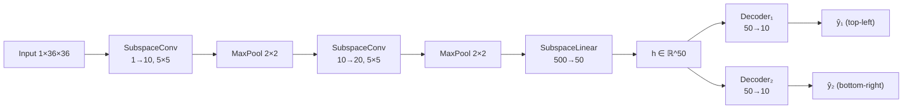
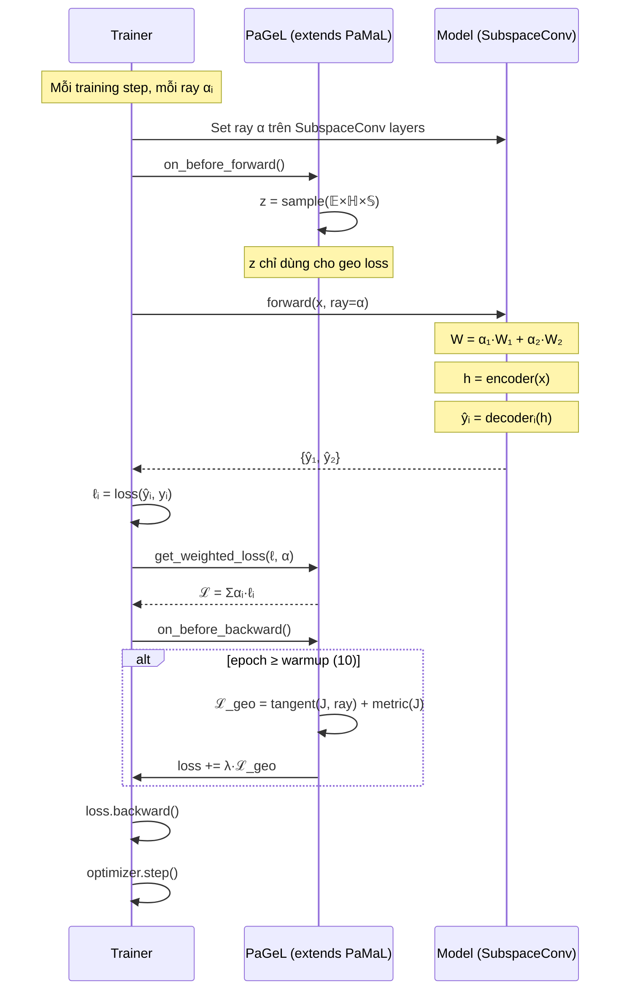

# PaGeL: Pareto Geometry Learning

## Mục lục
1. [Kiến thức nền tảng](#1-kiến-thức-nền-tảng)
2. [Thuật toán PaGeL](#2-thuật-toán-pagel)
3. [Kiến trúc mạng](#3-kiến-trúc-mạng)
4. [Training Flow](#4-training-flow)
5. [Geometry Loss chi tiết](#5-geometry-loss-chi-tiết)

---

## 1. Kiến thức nền tảng

### 1.1. Multi-Task Learning (MTL)

MTL train 1 model giải quyết nhiều task đồng thời. Ví dụ trên MultiMNIST:
- **Task 1**: Phân loại chữ số ở góc trên-trái
- **Task 2**: Phân loại chữ số ở góc dưới-phải

**Shared-Bottom architecture**: 1 encoder dùng chung, mỗi task có 1 decoder riêng:

```
Input → [Shared Encoder] → embedding h → Decoder₁ → ŷ₁ (top-left)
                                        → Decoder₂ → ŷ₂ (bottom-right)
```

**Vấn đề cốt lõi**: Cải thiện task 1 thường làm giảm task 2 → **trade-off**.

### 1.2. Pareto Optimality

Một solution `s₁` **dominate** `s₂` khi `s₁` tốt hơn hoặc bằng `s₂` trên **mọi** task, và tốt hơn strict trên ít nhất 1 task.

**Pareto front** = tập hợp tất cả solutions không bị dominated bởi solution nào khác. Mỗi điểm trên Pareto front là **tối ưu** — không thể cải thiện 1 task mà không hy sinh task khác.

```
Bottom-right acc ↑
     │  ● ● ●          ← Pareto front
     │    ● ● ●
     │      ○ ● ●       ○ = dominated (kém)
     │    ○   ○ ●
     └──────────── Top-left acc →
```

### 1.3. Preference Vector (Ray)

**Ray** `α = [α₁, α₂]` trên simplex (`Σαᵢ = 1, αᵢ ≥ 0`) biểu diễn preference:
- `α = [1, 0]` → ưu tiên tuyệt đối task 1
- `α = [0.5, 0.5]` → cân bằng
- `α = [0, 1]` → ưu tiên tuyệt đối task 2

Loss được scalarize: `ℒ = Σ αᵢ · ℓᵢ` (linear scalarization).

### 1.4. SubspaceConv (Nền tảng của PaMaL)

> **Theorem 4** (PaMaL paper): Với ReLU MLP, chỉ cần 2 bộ weight `θ, θ'` và nội suy tuyến tính `αθ + (1-α)θ'` là đủ xấp xỉ bất kỳ N continuous mappings.

SubspaceConv thay thế 1 Conv2d bằng **N bản copy weight** và nội suy:

$$W_{actual} = \sum_{i=1}^{m} \alpha_i \cdot W_i$$

Trong đó `αᵢ = ray[i]` và mỗi `Wᵢ` là 1 bản sao weight riêng.

```python
# SubspaceConv forward
def forward(self, x, **kwargs):
    alpha = self.alpha  # ray từ trainer
    W = sum(a * w for a, w in zip(alpha, self.weights))
    return F.conv2d(x, W, ...)
```

**Ý nghĩa**: Mỗi ray khác → weight khác → output khác → 1 điểm Pareto khác.

### 1.5. Riemannian Geometry cơ bản

Không gian Euclidean (phẳng) không phải lúc nào cũng phù hợp để mô tả cấu trúc dữ liệu. Riemannian manifold là không gian cong, nơi:

- **Tangent space** `T_pM`: không gian phẳng xấp xỉ manifold tại điểm `p`
- **Exponential map** `Exp_p(v)`: chiếu vector `v` từ tangent space lên manifold
- **Logarithmic map** `Log_p(q)`: chiếu điểm `q` trên manifold về tangent space tại `p`
- **Curvature** `κ`: độ cong — `κ = 0` (phẳng), `κ < 0` (hyperbolic), `κ > 0` (spherical)

### 1.6. Product Manifold (Mixed-Curvature)

PaGeL dùng **product manifold** kết hợp 3 loại không gian:

| Component | Ký hiệu | Curvature | Mô hình | Phù hợp cho |
|---|---|---|---|---|
| Euclidean | 𝔼^d₁ | κ = 0 | Phẳng | Cấu trúc tuyến tính |
| Hyperbolic | ℍ^d₂ | κ < 0 | Poincaré ball | Cấu trúc cây, hierarchy |
| Spherical | 𝕊^d₃ | κ > 0 | Hình cầu | Cấu trúc tuần hoàn, đối xứng |

$$\mathcal{Z} = \mathbb{E}^{d_1} \times \mathbb{H}^{d_2} \times \mathbb{S}^{d_3}$$

Curvature **learnable** — model tự tìm hình học phù hợp nhất cho Pareto front.

---

## 2. Thuật toán PaGeL

### 2.1. Ý tưởng chính

> **PaGeL = PaMaL + Geometry-aware Loss**

PaMaL đã giải quyết việc tạo Pareto front (SubspaceConv + ray interpolation). PaGeL thêm **regularization hình học** để Pareto front có cấu trúc manifold tốt hơn:
- Các gradient vuông góc với preference direction
- Ánh xạ bảo toàn metric (khoảng cách)

### 2.2. Công thức tổng loss

$$\mathcal{L}_{total} = \underbrace{\sum_{i=1}^{m} \alpha_i \cdot \ell_i}_{\text{PaMaL loss}} + \lambda_{geo} \cdot \underbrace{(\lambda_t \cdot \mathcal{L}_{tangent} + \lambda_m \cdot \mathcal{L}_{metric})}_{\text{Geometry loss (PaGeL)}}$$

| Symbol | Default | Ý nghĩa |
|---|---|---|
| `αᵢ` | từ ray | Preference weight (SubspaceConv interpolation) |
| `λ_geo` | 0.01 | Scale geometry loss |
| `λ_t` | 1.0 | Weight tangent alignment |
| `λ_m` | 0.1 | Weight metric preservation |
| warmup | 10 epochs | Epochs chỉ dùng PaMaL loss, chưa bật geometry |

### 2.3. So sánh PaGeL vs PaMaL

| | PaMaL | PaGeL |
|---|---|---|
| Layer conversion | SubspaceConv | SubspaceConv (kế thừa) |
| Weight interpolation | `W = Σ αᵢ·Wᵢ` | Giống PaMaL |
| Pareto diversity | ✅ (mỗi ray → khác weight) | ✅ (giống PaMaL) |
| Geometry regularization | ❌ | ✅ Tangent + Metric loss |
| Learnable curvature | ❌ | ✅ `κ_hyp`, `κ_sph` |
| Code kế thừa | Base class | `class PaGeL(PaMaL)` |

---

## 3. Kiến trúc mạng

### 3.1. Model (MultiMNIST — LeNet)



Mỗi SubspaceConv chứa **m bản copy weight** (m = num_tasks = 2):
```
SubspaceConv.weights = [W₁, W₂]  (2 bộ weight)
Forward: W = α₁·W₁ + α₂·W₂      (nội suy bởi ray)
```

### 3.2. Product Manifold Latent

Không tham gia vào forward pass — chỉ dùng cho geometry loss:

```
z = [z_euc ‖ z_hyp ‖ z_sph] ∈ ℝ^48

z_euc ~ N(0, 0.01·I)                           (16-dim)
z_hyp = Proj(Exp₀(v, κ_hyp)), v ~ N(0, 0.01·I) (16-dim)
z_sph = Proj(Exp₀(v, κ_sph)), v ~ N(0, 0.01·I) (16-dim)
```

Curvature learnable qua softplus:
- `κ_hyp = -softplus(θ_hyp) < 0`
- `κ_sph = +softplus(θ_sph) > 0`

---

## 4. Training Flow



---

## 5. Geometry Loss chi tiết

### 5.1. Jacobian

$$J_{ij} = \frac{\partial \ell_i}{\partial z_j}, \quad J \in \mathbb{R}^{m \times d}$$

`J` đo lường: khi z thay đổi, các task losses thay đổi bao nhiêu.

### 5.2. Tangent Alignment

$$\mathcal{L}_{tangent} = \|J^T \cdot n\|^2$$

- `n = ray` (xấp xỉ normal của Pareto surface)
- `J^T n ∈ ℝ^d` = projection của normal lên tangent space

**Mục tiêu**: `J^T n → 0` — di chuyển trên manifold theo hướng normal không nên thay đổi trade-off. Nói cách khác, Pareto surface nên **smooth** theo hướng preference.

### 5.3. Metric Preservation

$$\mathcal{L}_{metric} = \frac{1}{d^2} \left\| \frac{J^T J}{s} - I \right\|_F^2$$

- `J^T J` = pullback metric (metric kéo từ loss space về latent space)
- `s = mean(diag(J^T J))` = normalization
- `I` = identity (metric Euclidean)

**Mục tiêu**: Ánh xạ z → losses không bóp méo khoảng cách quá nhiều. Giữ cho mapping gần **isometric**.

### 5.4. Warmup

Geometry loss chỉ bật sau **10 epochs** (mặc định):
- Epoch 1–10: chỉ PaMaL loss → model học trade-off cơ bản
- Epoch 11+: thêm geometry loss → refine Pareto structure

Lý do: geometry loss cần gradient ổn định, nếu bật quá sớm sẽ gây instability.

---

## File Map

| File | Chức năng |
|---|---|
| [pagel.py](file:///d:/palora/src/callbacks/methods/pagel.py) | `class PaGeL(PaMaL)` — kế thừa PaMaL, thêm geometry loss |
| [pagel_modules.py](file:///d:/palora/src/callbacks/methods/ll/pagel_modules.py) | [ProductManifoldLatent](file:///d:/palora/src/callbacks/methods/ll/pagel_modules.py#20-103) + [GeometryLoss](file:///d:/palora/src/callbacks/methods/ll/pagel_modules.py#105-153) |
| [pamal.py](file:///d:/palora/src/callbacks/methods/pamal.py) | Base class — SubspaceConv conversion |
| [subspace_modules.py](file:///d:/palora/src/callbacks/methods/ll/subspace_modules.py) | [SubspaceConv](file:///d:/palora/src/callbacks/methods/ll/subspace_modules.py#69-113), [SubspaceLinear](file:///d:/palora/src/callbacks/methods/ll/subspace_modules.py#115-152), [SubspaceBatchNorm2d](file:///d:/palora/src/callbacks/methods/ll/subspace_modules.py#154-239) |
| [pagel.yaml](file:///d:/palora/configs/experiment/multimnist/method/pagel.yaml) | Hydra config |
